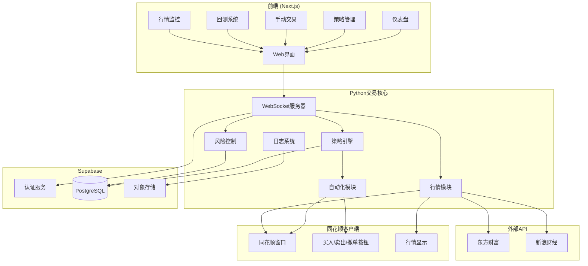
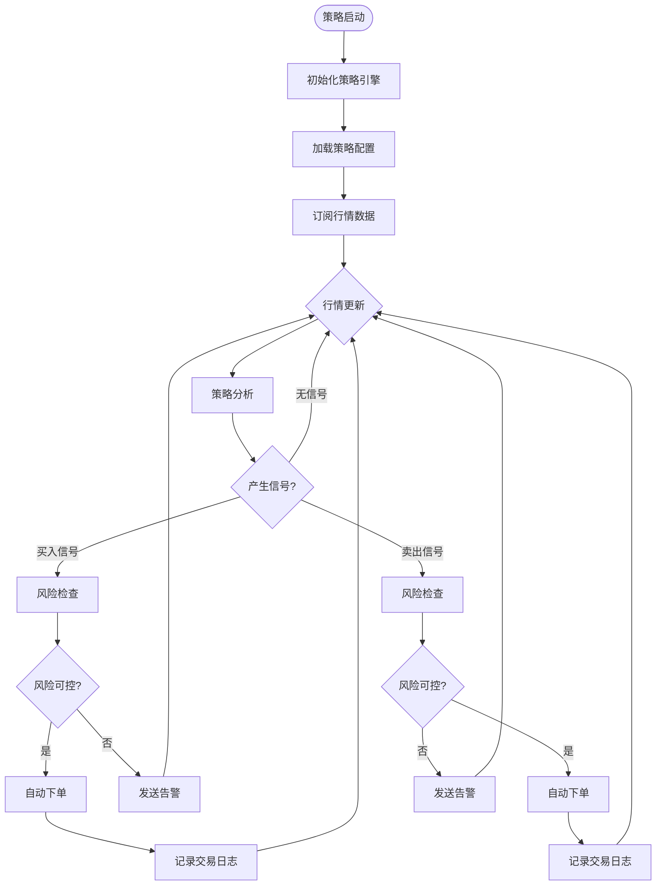
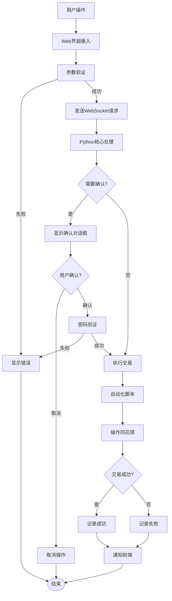

# StockAutoTrader - 股票全自动交易软件架构设计文档

## 项目概述

基于混合架构的股票全自动交易软件，通过自动化脚本控制同花顺客户端进行交易，支持策略自动交易、手动辅助交易、行情监控和提醒、回测系统。

---

## 技术栈

| 层级 | 技术选型 |
|-----|---------|
| 前端 | Next.js 16+ (App Router) + TypeScript + Tailwind CSS + shadcn/ui |
| 后端核心 | Python 3.11+ (async/await) |
| 自动化 | pyautogui + pywin32 + OpenCV |
| 数据库 | Supabase (PostgreSQL) |
| 通信 | WebSocket (实时数据推送) + REST API |
| 认证 | Supabase Auth |
| 行情数据 | 东方财富API / 新浪财经API + 同花顺屏幕读取 |
| 回测 | pandas + numpy (历史数据处理) |

---

## 1. 系统架构图



---

## 2. 核心业务流程

### 2.1 自动交易流程



### 2.2 手动交易流程



---

## 3. 数据模型设计

```mermaid
erDiagram
    auth_users ||--o{ strategies : creates
    auth_users ||--o{ positions : owns
    strategies ||--o{ strategy_signals : generates
    positions ||--o{ orders : has
    orders ||--o| trades : results_in
    auth_users ||--o{ alerts : configures
    auth_users ||--o{ backtests : runs

    auth_users {
        uuid id PK
        string email
        string encrypted_password
        datetime created_at
    }

    strategies {
        uuid id PK
        uuid user_id FK
        string name
        string type "策略类型: ma/macd/kdj/breakout/grid"
        jsonb parameters "策略参数"
        boolean enabled
        datetime created_at
        datetime updated_at
    }

    strategy_signals {
        uuid id PK
        uuid strategy_id FK
        string symbol "股票代码"
        string signal_type "buy/sell"
        float price
        jsonb metadata
        boolean executed
        datetime created_at
    }

    positions {
        uuid id PK
        uuid user_id FK
        string symbol "股票代码"
        int quantity "持仓数量"
        float cost_price "成本价"
        float current_price "当前价"
        float profit_loss "盈亏"
        datetime created_at
        datetime updated_at
    }

    orders {
        uuid id PK
        uuid position_id FK
        string order_id "委托单号"
        string symbol
        string side "buy/sell"
        int quantity
        float price
        string status "pending/partial_filled/filled/cancelled/failed"
        datetime created_at
        datetime updated_at
    }

    trades {
        uuid id PK
        uuid order_id FK
        string trade_id "成交编号"
        string symbol
        string side
        int quantity
        float price
        float commission "手续费"
        datetime created_at
    }

    market_data {
        uuid id PK
        string symbol
        float open
        float high
        float low
        float close
        int volume
        float amount
        datetime timestamp
        unique symbol, timestamp
    }

    alerts {
        uuid id PK
        uuid user_id FK
        string symbol
        string condition_type "price/volume/indicator"
        jsonb condition
        boolean triggered
        datetime triggered_at
        datetime created_at
    }

    backtests {
        uuid id PK
        uuid user_id FK
        string strategy_type
        jsonb parameters
        date start_date
        date end_date
        float initial_capital
        float final_capital
        float total_return
        float max_drawdown
        float sharpe_ratio
        int total_trades
        jsonb detailed_results
        datetime created_at
    }
```

---

## 4. 模块架构设计

### 4.1 Python 核心模块结构

```
trading-core/
├── config/                 # 配置管理
│   ├── __init__.py
│   └── settings.py        # 应用设置（Pydantic）
│
├── automation/            # 自动化交易模块
│   ├── __init__.py
│   ├── window.py         # 窗口识别和定位
│   ├── trader.py         # 同花顺自动化操作
│   ├── screenshot.py     # 截图功能
│   └── templates/        # UI元素模板图片
│
├── strategies/            # 策略引擎
│   ├── __init__.py
│   ├── base.py           # 策略基类
│   ├── engine.py         # 策略执行引擎
│   ├── ma_strategy.py    # 均线策略
│   ├── macd_strategy.py  # MACD策略
│   ├── kdj_strategy.py   # KDJ策略
│   ├── breakout.py       # 突破策略
│   └── grid.py           # 网格交易策略
│
├── market/                # 行情数据模块
│   ├── __init__.py
│   ├── fetcher.py        # 行情获取（API + 同花顺）
│   ├── processor.py      # 数据处理
│   ├── cache.py          # 行情缓存
│   └── indicators.py     # 技术指标计算
│
├── websocket/             # WebSocket服务器
│   ├── __init__.py
│   ├── server.py         # WebSocket服务器
│   ├── handlers.py       # 消息处理器
│   └── broadcast.py      # 广播功能
│
├── database/              # 数据库操作
│   ├── __init__.py
│   ├── client.py         # Supabase客户端
│   ├── models.py         # 数据模型
│   └── repositories.py   # 数据访问层
│
├── risk/                  # 风险控制
│   ├── __init__.py
│   ├── position.py       # 仓位管理
│   ├── stop_loss.py      # 止损止盈
│   └── limits.py         # 交易限制
│
├── backtest/              # 回测系统
│   ├── __init__.py
│   ├── engine.py         # 回测引擎
│   ├── data.py           # 历史数据获取
│   └── report.py         # 报告生成
│
├── utils/                 # 工具函数
│   ├── __init__.py
│   ├── logger.py         # 日志工具
│   └── helpers.py        # 辅助函数
│
├── tests/                 # 测试
│   └── ...
│
├── main.py               # 程序入口
├── requirements.txt      # 依赖列表
└── .env.example          # 配置模板
```

### 4.2 Next.js 前端结构

```
hello-nextjs/
├── src/
│   ├── app/
│   │   ├── layout.tsx           # 根布局
│   │   ├── page.tsx             # 首页
│   │   ├── login/               # 登录页
│   │   ├── register/            # 注册页
│   │   ├── dashboard/           # 仪表盘
│   │   ├── strategies/          # 策略管理
│   │   ├── trade/               # 手动交易
│   │   ├── backtest/            # 回测系统
│   │   ├── alerts/              # 行情监控
│   │   ├── positions/           # 持仓管理
│   │   └── api/                 # API路由
│   │
│   ├── components/
│   │   ├── ui/                  # UI组件（shadcn/ui）
│   │   ├── layout/              # 布局组件
│   │   ├── dashboard/           # 仪表盘组件
│   │   ├── strategies/          # 策略组件
│   │   ├── trade/               # 交易组件
│   │   └── charts/              # 图表组件
│   │
│   ├── lib/
│   │   ├── supabase/            # Supabase客户端
│   │   ├── websocket.ts         # WebSocket客户端
│   │   └── utils.ts             # 工具函数
│   │
│   └── types/
│       └── index.ts             # TypeScript类型定义
│
└── ...
```

---

## 5. API 设计

### 5.1 REST API

| 方法 | 路径 | 描述 |
|-----|------|-----|
| **策略管理** |
| GET | /api/strategies | 获取策略列表 |
| POST | /api/strategies | 创建策略 |
| PUT | /api/strategies/:id | 更新策略 |
| DELETE | /api/strategies/:id | 删除策略 |
| POST | /api/strategies/:id/enable | 启用策略 |
| POST | /api/strategies/:id/disable | 禁用策略 |
| **持仓管理** |
| GET | /api/positions | 获取持仓列表 |
| GET | /api/positions/:symbol | 获取单个持仓 |
| **交易操作** |
| POST | /api/trade/buy | 买入请求 |
| POST | /api/trade/sell | 卖出请求 |
| POST | /api/trade/cancel | 撤单请求 |
| POST | /api/trade/clear-all | 一键清仓 |
| **行情数据** |
| GET | /api/market/:symbol | 获取实时行情 |
| GET | /api/market/:symbol/kline | 获取K线数据 |
| **回测** |
| POST | /api/backtest | 运行回测 |
| GET | /api/backtest/:id | 获取回测结果 |
| **告警** |
| GET | /api/alerts | 获取告警规则 |
| POST | /api/alerts | 创建告警规则 |
| DELETE | /api/alerts/:id | 删除告警规则 |

### 5.2 WebSocket 消息协议

#### 客户端 → 服务器

```typescript
// 订阅行情
{
  type: "subscribe",
  channel: "market",
  symbols: ["000001", "000002"]
}

// 取消订阅
{
  type: "unsubscribe",
  channel: "market",
  symbols: ["000001"]
}

// 交易请求
{
  type: "trade",
  action: "buy" | "sell",
  symbol: "000001",
  quantity: 100,
  price: 10.5
}

// 策略控制
{
  type: "strategy",
  action: "start" | "stop",
  strategyId: "uuid"
}
```

#### 服务器 → 客户端

```typescript
// 行情推送
{
  type: "market_update",
  data: {
    symbol: "000001",
    price: 10.5,
    change: 0.5,
    volume: 10000
  }
}

// 交易状态
{
  type: "trade_status",
  status: "success" | "failed",
  message: "...",
  data: {...}
}

// 策略信号
{
  type: "strategy_signal",
  strategyId: "uuid",
  symbol: "000001",
  signal: "buy" | "sell",
  price: 10.5
}

// 告警触发
{
  type: "alert",
  alertId: "uuid",
  symbol: "000001",
  message: "价格突破10元"
}

// 系统状态
{
  type: "system_status",
  ths_connected: true,
  strategy_running: true
}
```

---

## 6. 自动化脚本设计

### 6.1 同花顺窗口识别

使用 OpenCV 模板匹配识别关键UI元素：

```python
# 伪代码示例
class THSWindow:
    def find_window(self):
        """查找同花顺窗口句柄"""
        pass

    def locate_element(self, template_name):
        """定位UI元素（买入/卖出按钮等）"""
        template = cv2.imread(f"templates/{template_name}.png")
        screenshot = pyautogui.screenshot()
        result = cv2.matchTemplate(screenshot, template, cv2.TM_CCOEFF_NORMED)
        return result

    def click_button(self, template_name):
        """点击指定按钮"""
        location = self.locate_element(template_name)
        pyautogui.click(location)
```

### 6.2 交易操作流程

```python
# 买入流程
def buy_stock(symbol: str, quantity: int, price: float):
    # 1. 找到股票代码输入框
    # 2. 输入股票代码
    # 3. 定位买入价格输入框
    # 4. 输入价格
    # 5. 定位数量输入框
    # 6. 输入数量
    # 7. 点击买入按钮
    # 8. 等待确认对话框
    # 9. 点击确认
    # 10. 截图保存
    # 11. 记录日志
```

---

## 7. 风险控制机制

### 7.1 多层风险检查

```python
class RiskController:
    def pre_trade_check(self, signal: TradeSignal) -> bool:
        # 1. 检查单笔交易金额限制
        if not self.check_amount_limit(signal):
            return False

        # 2. 检查单股仓位限制
        if not self.check_position_limit(signal):
            return False

        # 3. 检查总仓位限制
        if not self.check_total_position(signal):
            return False

        # 4. 检查日内交易次数
        if not self.check_daily_trade_count():
            return False

        # 5. 检查日内亏损限制
        if not self.check_daily_loss_limit():
            return False

        return True
```

### 7.2 止损止盈

```python
# 持仓级别的止损止盈
class PositionMonitor:
    async def monitor_positions(self):
        for position in self.positions:
            # 止损检查
            if position.loss_ratio >= settings.STOP_LOSS_RATIO:
                await self.execute_sell(position)

            # 止盈检查
            if position.profit_ratio >= settings.TAKE_PROFIT_RATIO:
                await self.execute_sell(position)
```

---

## 8. 环境变量配置

```env
# .env.example

# Supabase
SUPABASE_URL=your_supabase_url
SUPABASE_KEY=your_supabase_key

# WebSocket
WS_PORT=8765
WS_HOST=localhost

# Trading
TRADING_PASSWORD=your_trading_password
MAX_POSITION_RATIO=0.3
MAX_DAILY_LOSS_RATIO=0.05

# Risk Control
ENABLE_RISK_CONTROL=true
STOP_LOSS_RATIO=0.05
TAKE_PROFIT_RATIO=0.10
MAX_TRADES_PER_DAY=10

# Logging
LOG_LEVEL=INFO
LOG_FILE=logs/trading.log

# Market Data
MARKET_DATA_SOURCE=both
ENABLE_THS_DATA=true
ENABLE_API_DATA=true

# Automation
AUTO_LOGIN=false
AUTO_CONFIRM=false
SCREENSHOT_PATH=screenshots
```

---

## 9. 安全机制

1. **交易密码二次确认**：所有交易操作需密码确认
2. **操作日志**：记录所有敏感操作
3. **策略沙箱**：策略可先在模拟模式运行
4. **紧急停止**：一键停止所有策略
5. **交易限额**：单日最大交易金额限制
6. **权限控制**：基于 Supabase Auth 的权限管理

---

## 10. 开发计划

项目分为20个任务，按以下顺序执行：

1. **架构设计** ✅ (当前任务)
2. Python 环境配置
3. 前端基础配置
4. 数据库 Schema 设计
5. 同花顺窗口识别
6. 自动化交易模块
7. 行情数据获取
8. 策略引擎框架
9. 前端 - 仪表盘
10. 前端 - 策略管理
11. 前端 - 手动交易
12. WebSocket 通信
13. 回测系统
14. 行情监控和提醒
15. 风险控制系统
16. 交易日志和分析
17. 系统监控和诊断
18. 预设策略实现
19. 安全机制
20. 测试和优化
